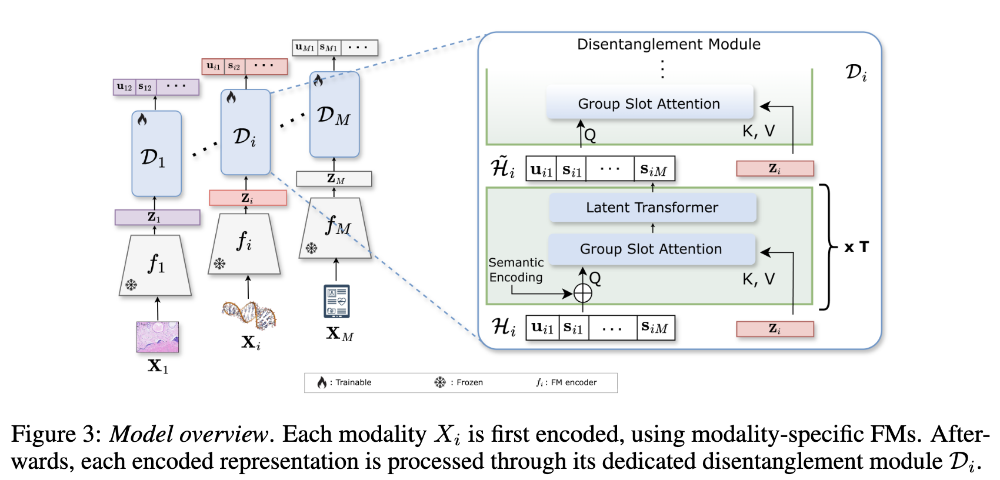

# RePercENT: Scaling Disentangled Representation Learning Beyond Two Modalities 

[](https://arxiv.org/search/?query=RePercENT%20Scaling%20Disentangled%20Representation%20Learning%20Beyond%20Two%20Modalities&searchtype=all)
[](requirements.txt)
[](https://pytorch.org/)
[](https://opensource.org/licenses/MIT)

Official PyTorch implementation of **RePercENT**, a multimodal disentangled representation learning framework designed to scale beyond the two-modality setting. The repository includes model implementations, synthetic and real-world training pipelines, JointOpt baselines, and posthoc evaluation scripts.



## Repository Map

| Path | Contents |
| --- | --- |
| [`src/`](src/README.md) | Core RePercENT, Perceiver, JointOpt, data utilities, and adapted third-party components. |
| [`training/`](training/README.md) | Training entry points for synthetic, IRFL, and TCGA/HONeYBEE experiments. |
| [`configs/`](configs/) | Model, data, training, and posthoc analysis configuration files. |
| [`posthoc/synthetic/`](posthoc/synthetic/README.md) | Synthetic experiment evaluation, probes, complexity, and summary plots. |
| [`posthoc/irfl/`](posthoc/irfl/README.md) | IRFL detection-task evaluation and embedding visualizations. |
| [`posthoc/honeybee/`](posthoc/honeybee/README.md) | TCGA/HONeYBEE cancer-type probes, baselines, visualizations, and missing modality analysis. |
| [`fine_tuning/`](fine_tuning/) | CLIP fine-tuning helpers for IRFL-related experiments. |

## Setup

```bash
pip install -r requirements.txt
```

## Upon request

- The preprocessed HONeYBEE train/ test split.
- The final train-test tensor and augmented views for the IRFL detection pipeline.
- The used generated synthetic datasets. 

## Citation
Preprint coming soon.

```bibtex
@misc{repercent2026,
  title = {RePercENT: Scaling Disentangled Representation Learning Beyond Two Modalities},
  author = {TBD},
  year = {2026},
  note = {Preprint coming soon}
}
```

## Acknowledgements

Parts of this repository adapt code from: <a href="https://github.com/uhlerlab/DisentangledSSL/tree/master"> DisentangledSSL</a>, and the gMLP baseline uses vendored third-party code under src/models/third_party/.